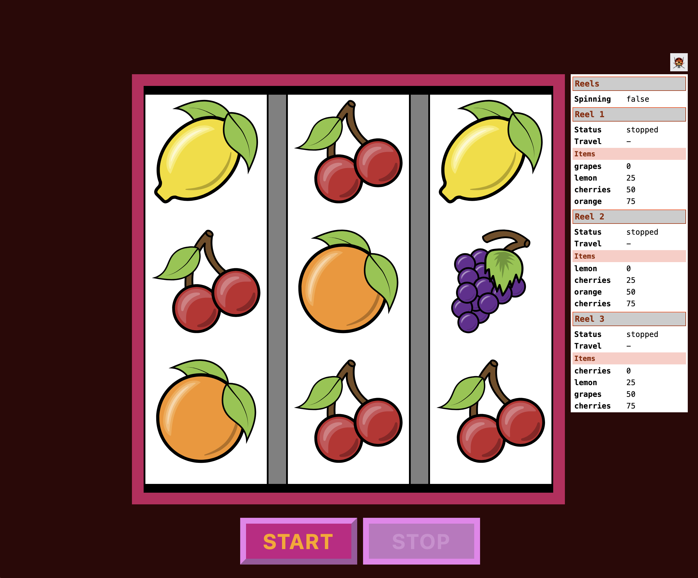

# Open Fruit Machine



## Contributions

Contributions are welcome. ~~See [CONTRIBUTING.md](CONTRIBUTING.md)~~ (currently a stub).

## Clone the Repo

```
git clone https://github.com/pecknigel/open-fruit-machine.git
```

## Run the Dev Server

Run `npm start` to start the development server. Navigate to http://localhost:4200/. The application will automatically reload if you change any of the source files.

## Scaffolding

Run `ng generate component components/component-name` to generate a new component. You can also use `ng generate directive|pipe|service|class|guard|interface|enum|module`.

## More Help with Angular CLI

To get more help on the Angular CLI use `ng help` or go check out the [Angular CLI Overview and Command Reference](https://angular.dev/tools/cli) page.

## Build

Run `ng build` to build the project. The build artifacts will be stored in the `dist/` directory.

## Licensing

This project is dual licensed. See [LICENSE.txt](LICENSE.txt).

----

The original scaffolding for this project was generated with [Angular CLI](https://github.com/angular/angular-cli) version 18.2.3 - 09/09/2024 14:06 CST.
